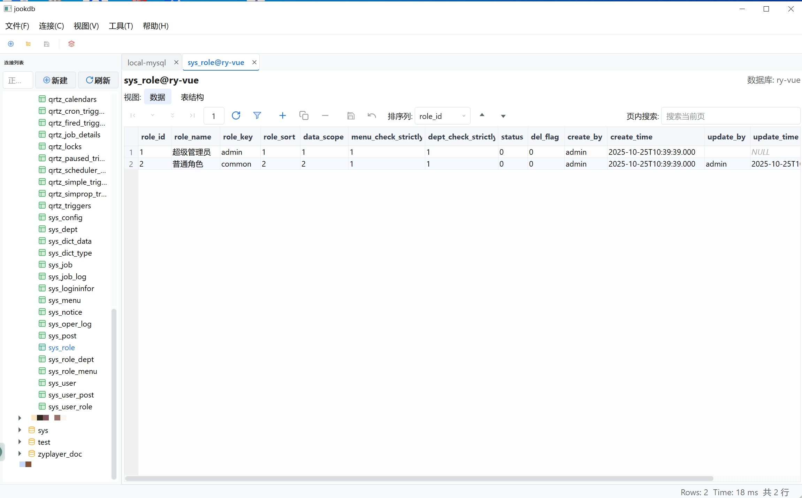
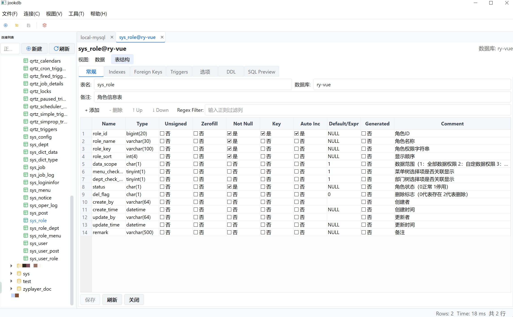

# OpenDBKit

OpenDBKit 是一款以 **简单、快捷** 为目标的桌面数据库管理工具，支持在同一窗口中查看连接、运行 SQL、编辑数据与同步结构。它基于 [jookdb](https://github.com/jooksoft/jookdb) 的开源代码继续演进，感谢原作者开放源代码，当前仓库在其基础上聚焦轻量化体验与社区协作。之所以创建此项目，是因为上游 jookdb 开源版本缺失若干依赖文件导致无法完整编译/打包，希望在社区内补齐缺口并持续维护；界面风格也参考了 jookdb 的交互与布局，并在其基础上继续迭代。

> **命名说明**：为了与原项目区分并强调开源属性，本仓库在发布时更名为 **OpenDBKit**，仍然遵循 GPLv3 许可证。

## 界面截图




## 使用须知 / 免责声明

- **本项目功能未经过完善的测试，可能还存在 BUG**；特别是在一些细节功能方面。欢迎各位用户在使用过程中发现问题后提出 Issue 或 Pull Request。
- 由于上述测试尚未完善，**⚠️ 强烈建议请勿将本工具用于生产环境！**。若因使用本工具导致数据丢失或业务中断，后果须由使用者自行承担，项目维护者概不负责。
- 请务必做好备份与权限隔离：避免将生产凭证提交到仓库、优先使用只读账户、在执行结构变更或批量操作前先导出备份，并在可信环境运行本工具。
- 所有第三方驱动、脚本与打包产物均需由使用者自行验证安全性与许可证合规性；若要二次分发，请重新检查依赖来源及哈希。
- 本仓库主要通过 AI 协作（Codex、Claude Code 等）完成“vibe coding”，仍需社区开发者共同审阅与完善。

## 核心特性

- **多连接资源树**：通过 `MyTreeWidget` 管理数据库、库表与常用操作，快速切换连接、刷新结构或打开数据页。
- **双模式查询工作台**：`QueryForm` 既可作为 SQL 编辑器，也提供 Inspect 模式（表结构/数据页签），内置过滤、排序、行复制与导出。
- **数据编辑与导出**：`ResultForm` 支持就地编辑、批量复制、CSV/TSV/XLSX 导出、筛选等常用操作，适合日常巡检与修复。
- **结构管理**：`TableDesignerDialog`、`DatabaseManagerForm` 提供列信息、索引、外键与触发器的可视化维护能力。
- **同步与导入导出**：`DataSyncDialog`、`ImportDialog` 等模块覆盖常见的数据同步、批量导入和脚本执行场景。
- **Qt/MinGW 原生应用**：使用 Qt 5.15 + MinGW 8.1 构建，脚本 `pack_jookdb.bat` 可一键打包依赖，方便发行。

## 目录结构

```
.
├─cpp/                 # Qt C++ 源码（UI、业务逻辑、插件）
├─img/                 # UI 资源与图标
├─language/            # Qt Linguist 语言包
├─lib/                 # JDBC/JAR 等第三方依赖（运行期加载）
├─build-mingw-release/ # MinGW 构建输出目录（由脚本生成）
├─dist/                # 发布产物目录（由脚本生成）
├─pack_jookdb.bat      # Windows 打包脚本（Release）
└─third_party/         # 第三方库（如 MySQL 头文件）
```

## 构建与运行

### 先决条件

- Windows 10。
- [Qt 5.15.2] + MinGW 8.1（与脚本默认配置一致）。
- 已安装 `mingw32-make`、`windeployqt`，并通过 `QTDIR\bin` 添加到 `PATH`。

### 手动构建打包步骤

1. 进入QT的命令行环境MinGW。
2. cd到项目路径，运行pack_opendbkit.bat脚本，即可生成build和dist目录。
3. 进入dist目录，双击jookdb.exe即可在目标机器运行。

### 运行

执行 `dist\jookdb.exe`启动应用，首次使用请在连接面板创建 MySQL/MariaDB 连接。

## 未完成功能 / 路线图

当前版本仍有若干上游能力尚未接入或需要改进，欢迎社区贡献：

1. **多数据库驱动**：代码中仍以 `QMYSQL` 驱动为主，尚未重新接通 PostgreSQL / SQLite / Oracle 等驱动。需要补齐 Qt 驱动依赖与连接管理逻辑。
2. **Java/JDBC 桥接**：`lib/` 中保留了 JAR 依赖，但 Qt 与嵌入式 Java 工具之间的桥接尚未恢复，需要实现进程通信及驱动选择界面。
3. **跨平台支持**：目前仅在 Windows + MinGW 上验证。若需 macOS/Linux 版本，需要适配 Qt 安装、打包脚本以及数据库驱动。
4. **自动化测试**：`cpp/test.cpp` 仍为空壳，缺少 QtTest/集成测试，建议补充至少对 SQL 执行、导出和数据编辑的回归测试。
5. **文档与本地化**：`language/` 中仅包含部分翻译；暂无独立文档站点，后续可补充功能说明、脚本示例与截图。

> 欢迎在 Issue/PR 中讨论优先级，也可以在 README 中勾选已完成的项目。

### 免责声明

本软件按"原样"提供，不提供任何明示或暗示的保证，包括但不限于对适销性、特定用途适用性和非侵权性的保证。在任何情况下，作者或版权持有人均不对任何索赔、损害或其他责任负责，无论是在合同诉讼、侵权行为还是其他方面，由软件或软件的使用或其他交易引起或与之相关。


## 致谢与来源

- 本项目基于 [jookdb](https://github.com/jooksoft/jookdb) 的源码开发，衷心感谢 jookdb 团队开启代码与设计。
- 图标、驱动等资源亦沿用原项目，请在二次分发时遵守相关许可证。

## 许可证

OpenDBKit 继续沿用 jookdb 的 **GNU GPL v3** 许可证。任何衍生作品需要同样开源，并在分发时附带许可证文本。详见 `LICENSE` 文件。
